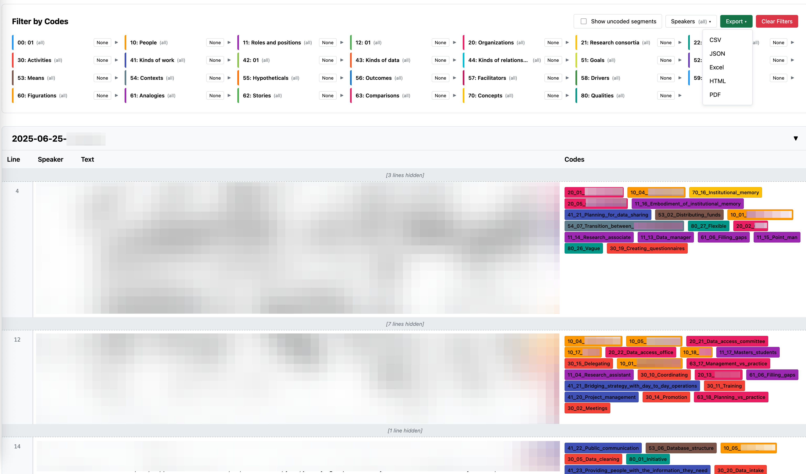

# qc-viz: Qualitative Coding Visualization

Interactive visualization tool for qualitative coding data. Works with the [qualitative-coding](https://github.com/cproctor/qualitative-coding/) Python package and [Quarto](https://quarto.org/).



## Features

- Interactive filtering by code categories and individual codes
- Multi-speaker filtering
- Toggle uncoded segments visibility
- Export to CSV, JSON, Excel, HTML, and PDF with filter parameters documented
- Persistent state, remembers your filter selections
- Color-coded tags with Johnny Decimal system support
- Privacy-focused, runs entirely locally, no data transmission
- Adapts to your own codebook

## Technical Details

### Architecture

The tool consists of:

1. **Bash script** (`qc-viz-pre-render.sh`): Generates JSON from corpus files
2. **Lua filter** (`qc-viz-filter.lua`): Processes JSON and generates HTML
3. **CSS** (`qc-viz.css`): Styling and layout
4. **JavaScript** (`qc-viz.js`): Interactivity and state management

### Workflow

```
Corpus files (.txt) 
    ↓
qc tool (coding)
    ↓
Bash script (JSON generation)
    ↓
Lua filter (HTML generation)
    ↓
qc-viz.html (visualization)
```

### Prerequisites

- [Quarto](https://quarto.org/docs/get-started/) (v1.3+)
- Python 3.8+ with [qualitative-coding](https://github.com/cproctor/qualitative-coding/) package
- Bash shell (Linux, macOS, or WSL on Windows)

**Note:** This can be easily adapted to work in non-quarto environments by simply calling the bash script to generate the json and then running the lua script to access and render those files.

## Installation

1. **Copy the tool** to your project's `assets/scripts/` directory:
   ```
   assets/
   └── scripts/
       └── qc-viz/
           ├── qc-viz.css
           ├── qc-viz.js
           ├── qc-viz-filter.lua
           └── qc-viz-pre-render.sh
   ```

2. **Make the pre-render script executable:**
   ```bash
   chmod +x assets/scripts/qc-viz/qc-viz-pre-render.sh
   ```

3. **Create a trigger document** (e.g., `qc-viz.qmd`):
   ```yaml
   ---
   title: "Qualitative Coding Visualization"
   format:
     html:
       filters:
         - assets/scripts/qc-viz/qc-viz-filter.lua
   ---
   
   This generates the qualitative coding visualization.
   ```

4. **Update your `_quarto.yml`:**
   ```yaml
   project:
     pre-render:
       - bash assets/scripts/qc-viz/qc-viz-pre-render.sh
   ```

## Project Structure

The tool expects the following structure, though all paths are configurable via environment variables:

```
your-project/
├── _quarto.yml                      # Quarto configuration
├── qc-viz.qmd                       # Trigger document
├── assets/
│   └── scripts/
│       └── qc-viz/                  # This repository
│           ├── qc-viz.css           # Styling
│           ├── qc-viz.js            # Interactivity
│           ├── qc-viz-filter.lua    # HTML generation
│           ├── qc-viz-pre-render.sh # JSON generation script
│           └── qc-viz-config.yaml   # Optional configuration
└── qc/                              # Qualitative coding directory
    ├── corpus/                      # Your interview transcripts
    │   ├── interview-01.txt
    │   ├── interview-02.txt
    │   └── exclude/                 # Files to exclude
    ├── json/                        # Generated (auto)
    └── qc-viz.html                  # Generated (auto)
```

## Usage

### Basic Workflow

1. **Code your interviews** using the `qc` command-line tool
2. **Exclude sensitive files** by moving them to `qc/corpus/exclude/`:
   ```bash
   qc corpus move corpus/interview.txt corpus/exclude/interview.txt
   ```
   ⚠️ **It is crucial that you use the qc command instead of `mv` to preserve the database's integrity!**

3. **Generate visualization:**
   ```bash
   quarto render qc-viz.qmd
   ```
4. **Open in browser:** `qc/qc-viz.html`

### Excluding Files

To exclude files from the visualization, simply move them to the `exclude/` subdirectory [using the qc move command](https://qualitative-coding.readthedocs.io/en/latest/manuscript.html#corpus-move-mv).

⚠️ Use `qc corpus move` instead of `mv`!

Files in `qc/corpus/exclude/` are:

- Skipped during JSON generation
- Not included in the visualization
- Still available for coding with the `qc` tool

This is useful for:

- Incomplete or in-progress interviews
- Sensitive data that shouldn't be visualized
- Test files or drafts
- Files that need further review before inclusion

### Custom Codebook Integration

qc-viz automatically reads your code schema from the `qualitative-coding` codebook. This means you don't need to manually configure category names or colors—they're pulled directly from your existing coding structure.

#### How Codebook Parsing Works

qc-viz reads from `qc/codebook.yaml` (the codebook used by the `qualitative-coding` package) and extracts category labels based on Johnny Decimal prefixes.

**Example codebook structure:**

```yaml
# qc/codebook.yaml
- 10_People:
  - 11_Roles:
    - 11_01_Leadership
    - 11_02_Principal_Investigators
  - 12_Identities:
    - 12_01_Disciplinary_backgrounds
- 50_Challenges_and_resolutions:
  - 51_Goals:
    - 51_01_Project_goals
    - 51_02_Initial_goals
  - 52_Challenges:
    - 52_01_Technical_challenges
    - 52_02_Coordination_challenges
```

**Extracted schema:**

qc-viz will automatically extract:

- `11` → "Roles"
- `12` → "Identities"
- `51` → "Goals"
- `52` → "Challenges"

The category labels come from the first level of nesting (e.g., `11_Roles` → "Roles").

#### Schema Priority

qc-viz uses the following priority order for determining category names and colors:

1. **Codebook** (highest priority) - Read from `qc/codebook.yaml`
2. **Config file** - Manually specified in `qc-viz-config.yaml`
3. **Built-in defaults** - Fallback schema included in the tool
4. **Auto-generated** (lowest priority) - Derived from the first code in each category

#### Enabling/Disabling Codebook Integration

By default, codebook integration is **enabled**. To disable it:

```yaml
# qc-viz-config.yaml
codebook:
  enabled: false
  path: "qc/codebook.yaml"  # Custom path if needed
```

When disabled, qc-viz will fall back to the config file or built-in defaults.

#### Custom Code Schema (Manual Configuration)

If you prefer to manually specify your code schema or need to override the codebook, use the config file:

```yaml
# qc-viz-config.yaml
code_schema:
  categories:
    "10": "People"
    "11": "Roles and positions"
    "20": "Organizations"
    "50": "Challenges and resolutions"
    "51": "Goals"
    "52": "Challenges"
  colors:
    "10": "#2196F3"
    "11": "#1976D2"
    "20": "#FF9800"
    "50": "#E91E63"
    "51": "#C2185B"
    "52": "#AD1457"
  default_color: "#757575"
```

**Note:** Manual configuration in the config file takes precedence over the built-in defaults but is overridden by the codebook (unless codebook integration is disabled).

#### Color Assignment

Colors are assigned based on:

1. Config file colors (if specified)
2. Auto-generated palette (20 distinct colors, wraps around if more categories exist)

Colors are applied consistently across:

- Category border colors in the filter panel
- Code tag background colors in the data tables

#### Troubleshooting Schema Issues

**Categories not appearing:**

- Check that `qc/codebook.yaml` exists and is valid YAML
- Verify codes follow the Johnny Decimal naming convention (`NN_Name` where NN is 10-99)
- Enable verbose mode to see schema parsing: `export QC_VERBOSE=true`

**Wrong category names:**

- Check codebook structure—category names come from first-level nesting
- Verify the codebook format matches the qualitative-coding package structure
- Try manually specifying the schema in the config file

**Colors not matching expectations:**

- Specify custom colors in `qc-viz-config.yaml` under `code_schema.colors`
- Colors must be valid hex codes (e.g., `#2196F3`)

## Configuration
qc-viz supports flexible configuration through a YAML file or environment variables. Configuration precedence (highest to lowest):

1. Environment variables
2. YAML configuration file
3. Default values

Create a `qc-viz-config.yaml` file in your project root for custom settings:

```yaml
# See assets/scripts/qc-viz/qc-viz-config.yaml for full example

# Basic paths
directories:
  qc_dir: "qc"
  corpus_dir: "qc/corpus"
  json_dir: "qc/json"
  exclude_dir: "qc/corpus/exclude"

# Code filtering - exclude deprecated codes
code_filters:
  blacklist:
    enabled: true
    branches:
      - name: "old_codes"
        recursive: true

# Custom code schema
code_schema:
  categories:
    "51": "Goals"
    "52": "Challenges"
  colors:
    "51": "#C2185B"
    "52": "#AD1457"
```

### Including/Excluding Codes

qc-viz provides powerful filtering to include or exclude codes from visualization. This is especially useful for:

- Excluding orphaned or deprecated codes
- Hiding codes under an "old_codes" branch
- Working with multiple codebooks
- Focusing on specific code categories

**Whitelist Mode** (include only specific codes):

```yaml
code_filters:
  whitelist:
    enabled: true
    codes:                    # Specific codes
      - "51_02_Initial_goals"
      - "62_01_Origin_story"
    prefixes:                 # Johnny Decimal prefixes
      - "51_"
      - "52_"
    prefix_ranges:            # Ranges of prefixes
      - "50-59"               # Codes 50_ through 59_
    patterns:                 # Regex patterns
      - ".*_goals$"           # Codes ending with _goals
    branches:                 # Code tree branches
      - name: "challenges"
        recursive: true       # Include all child codes
```

**Blacklist Mode** (exclude specific codes):

```yaml
code_filters:
  blacklist:
    enabled: true
    codes:                    # Specific codes to exclude
      - "99_test_code"
    prefixes:                 # Exclude by prefix
      - "99_"
    prefix_ranges:            # Exclude prefix ranges
      - "90-99"
    patterns:                 # Regex patterns
      - ".*_old$"             # Exclude codes ending with _old
    branches:                 # Exclude entire branches
      - name: "old_codes"
        recursive: true       # Exclude all descendants
      - name: "drafts"
        recursive: false      # Only exclude exact match
```

**Filtering Logic:**

- If whitelist is enabled, ONLY whitelisted codes are included (blacklist is ignored)
- If whitelist is disabled, all codes are included EXCEPT blacklisted ones
- Multiple filter types within a mode are combined with OR logic
- Use `recursive: true` for branches to exclude all descendants
- Use `recursive: false` to match only the exact branch name

**Common Use Cases:**

```yaml
# Exclude old/deprecated codes
code_filters:
  blacklist:
    enabled: true
    branches:
      - name: "old_codes"
        recursive: true
      - name: "deprecated"
        recursive: true

# Focus on specific analysis (goals and challenges only)
code_filters:
  whitelist:
    enabled: true
    prefix_ranges:
      - "50-59"

# Exclude test codes and temporary annotations
code_filters:
  blacklist:
    enabled: true
    patterns:
      - "^test_"
      - "^temp_"
      - ".*_draft$"
```

### Additional Configuration Options
#### Display Options

```yaml
display:
  sections:
    default_collapsed: false
    preserve_filename_format: true
  code_tags:
    show_full_code: true
```

#### Environment Variables

Override any setting:

```bash
export QC_DIR="my-qc-directory"
export QC_CORPUS_DIR="$QC_DIR/interviews"
export QC_VIZ_CONFIG="custom-config.yaml"
quarto render qc-viz.qmd
```

## Data Formats

### Corpus Files

Text files should use speaker attributions:

```
Interviewer: Can you tell me about your experience?
Participant: Well, it started when I joined the project...
Interviewer: What happened next?
Participant: Then we discovered an interesting pattern.
```

Lines without a speaker prefix inherit the most recent speaker.

### JSON Output

The tool processes JSON generated by:
```bash
qc codes find --json --pattern filename.txt --before 0 --after 0
```

Expected structure:
```json
[
  {
    "document": "interview.txt",
    "line": 3,
    "code": "51_02_Initial_goals",
    "text_lines": [3, 4],
    "text": "Full text of the coded segment..."
  }
]
```

**Note:** Line numbers are 0-indexed in JSON but the tool handles conversion automatically.

## Privacy & Security

### Data Handling

- ✅ No external data transmission
- ✅ All processing happens locally
- ✅ Generates self-contained HTML file
- ❌ Does not anonymize or redact content automatically

### Important Considerations

⚠️ **The generated HTML contains all visible text from your transcripts.** Handle appropriately:

- Use `exclude/` directory for sensitive files
- Configure [Quarto render targets](https://quarto.org/docs/projects/quarto-projects.html#render-targets) to exclude sensitive directories
- Add output files to `.gitignore` if working with private repositories
- Consider using [git submodules](https://git-scm.com/book/en/v2/Git-Tools-Submodules) for private data
- Maintain separate projects for analysis vs. publication

### Export Libraries

The export functionality loads these libraries from CDN:

- [SheetJS](https://cdn.sheetjs.com/) (xlsx.js) for Excel export
- [jsPDF](https://cdnjs.cloudflare.com) for PDF generation

These run in your browser and don't transmit data externally.

## Advanced Usage

### Custom Code Schema

Edit the `default_code_schema` in `qc-viz-filter.lua`:

```lua
local default_code_schema = {
  ["10"] = "People",
  ["20"] = "Organizations",
  ["50"] = "Challenges",
  -- Add your categories
}
```

Or use a config file (recommended).

### Integration with CI/CD

```yaml
# .github/workflows/render.yml
name: Render QC Viz
on: [push]
jobs:
  render:
    runs-on: ubuntu-latest
    steps:
      - uses: actions/checkout@v3
      - uses: quarto-dev/quarto-actions/setup@v2
      - run: quarto render qc-viz.qmd
      - uses: actions/upload-artifact@v3
        with:
          name: qc-viz
          path: qc/qc-viz.html
```

### Custom Styling

Override CSS by creating `qc-viz-custom.css`:

```css
/* Adjust category colors */
.filter-category {
  background: #fafafa;
}

/* Larger code tags */
.code-tag {
  font-size: 0.85rem;
  padding: 0.2rem 0.5rem;
}
```

Then reference it in your config:

```yaml
files:
  css_file: "assets/scripts/qc-viz/qc-viz-custom.css"
```

## Known Limitations

- Maximum ~1000 codes per category (performance)
- JSON files must be generated before rendering
- Line numbers must be continuous (no gaps)
- Speaker attribution required for proper display
- No real-time collaboration features


## Roadmap

- [ ] Codebook integration (auto-read schema)
- [ ] Code relationship visualization
- [ ] Search/highlight functionality
- [ ] Custom color palettes
- [ ] Dark mode

Contributions are welcome!

## License

MIT License: see [LICENSE](LICENSE) file for details.

## Credits

- Built for [qualitative-coding](https://github.com/cproctor/qualitative-coding/) by Chris Proctor
- Designed for [Quarto](https://quarto.org/) projects
- Developed by [Zack Batist](https://zackbatist.info/)

## Citation

If you use qc-viz in your research, please cite:

```bibtex
@software{batist2025qcviz,
  author = {Batist, Zachary},
  title = {qc-viz: Qualitative Coding Visualization},
  year = {2025},
  url = {https://github.com/zackbatist/qc-viz}
}
```

## Version History

- **v1.0**: Initial release with core features
  - Interactive filtering
  - Multi-speaker support
  - Export functionality
  - Directory-based exclusion

**Made with ❤️ for qualitative researchers**
